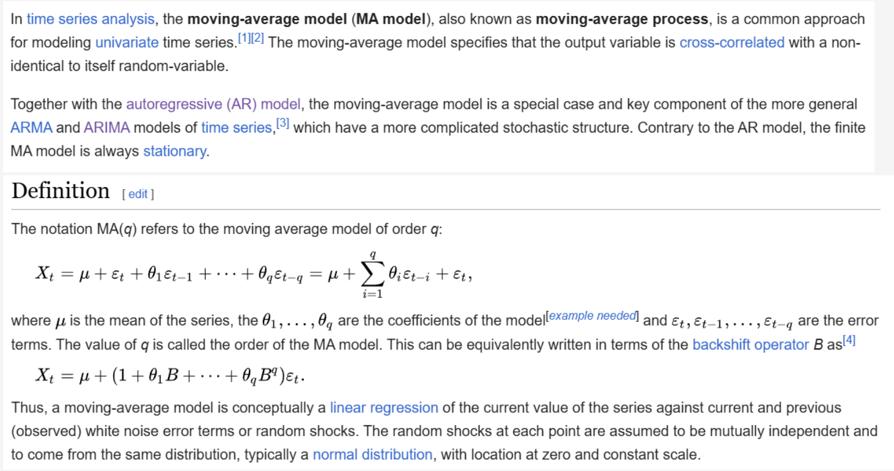

# Report Dettagliato: Simulazione di Serie Temporali con Modello ARIMA

## Indice
1. [Introduzione](#introduzione)
2. [Obiettivo del Notebook](#obiettivo-del-notebook)
3. [Strategia Sottostante](#strategia-sottostante)
4. [Dati Utilizzati](#dati-utilizzati)
5. [Implementazione Tecnica](#implementazione-tecnica)
6. [Modello ARIMA Utilizzato](#modello-arima-utilizzato)
7. [Generazione delle Simulazioni](#generazione-delle-simulazioni)
8. [Strategia di Trading: Bollinger Bands](#strategia-di-trading-bollinger-bands)
9. [Ottimizzazione Monte Carlo](#ottimizzazione-monte-carlo)
10. [Risultati e Visualizzazioni](#risultati-e-visualizzazioni)
11. [Conclusioni](#conclusioni)

---

## 1. Introduzione

Questo notebook dimostra un approccio avanzato alla simulazione di serie temporali finanziarie utilizzando modelli ARIMA (AutoRegressive Integrated Moving Average). L'obiettivo principale è generare migliaia di percorsi di prezzo simulati per testare e ottimizzare strategie di trading attraverso simulazioni Monte Carlo.

## 2. Obiettivo del Notebook

Il notebook ha tre obiettivi principali:

1. **Fitting di un modello ARIMA**: Adattare un modello ARIMA sui dati storici reali di EUR/GBP
2. **Simulazione di serie temporali**: Generare migliaia di percorsi di prezzo basati sul modello ARIMA fitted
3. **Ottimizzazione di strategia**: Testare una strategia Bollinger Bands su tutti i percorsi simulati per valutarne la robustezza

## 3. Strategia Sottostante

La strategia si basa su un **approccio di validazione statistica robusta** che prevede:

### 3.1 Principio Fondamentale
Invece di testare una strategia di trading solo sui dati storici (che potrebbero dare risultati fuorvianti a causa dell'overfitting), si genera un **ensemble di possibili futuri** basati sulle caratteristiche statistiche del mercato catturate dal modello ARIMA.

### 3.2 Flusso di Lavoro
```
Dati Storici → Fitting ARIMA → Estrazione Parametri → Simulazione Monte Carlo → 
Backtesting su ogni simulazione → Analisi distribuzione risultati
```

### 3.3 Vantaggi dell'Approccio
- **Robustezza**: La strategia viene testata su migliaia di scenari diversi ma statisticamente plausibili
- **Valutazione del rischio**: Si ottiene una distribuzione completa dei possibili risultati
- **Riduzione overfitting**: I risultati non dipendono da un singolo percorso storico

## 4. Dati Utilizzati

### 4.1 Fonte dei Dati
- **Coppia valutaria**: EUR/GBP (Euro vs Sterlina Britannica)
- **Frequenza**: 1 minuto
- **Fonte**: OneDrive (dati scaricati da piattaforme di trading)
- **URL**: `https://onedrive.live.com/download?resid=4E16D53638D067A9%21339325&authkey=!AHOCBUokDjDiCc8`

### 4.2 Preprocessing
```python
data_downloaded = pd.read_csv(url, parse_dates=True, index_col=0)
data_downloaded = data_downloaded.asfreq('T')  # Frequenza al minuto
data_downloaded.ffill(inplace=True)  # Forward fill per dati mancanti
```

Il preprocessing include:
- Parsing delle date come index
- Impostazione frequenza temporale a 1 minuto (`'T'`)
- Forward fill per gestire eventuali valori mancanti

### 4.3 Visualizzazione Dati Originali


I dati mostrano il tipico comportamento di una serie temporale finanziaria ad alta frequenza con:
- Trend di medio periodo
- Volatilità variabile nel tempo
- Assenza di stagionalità evidente

## 5. Implementazione Tecnica

### 5.1 Librerie Utilizzate
```python
from numba import njit, prange  # Per ottimizzazione performance
import pandas as pd
import numpy as np
import matplotlib.pyplot as plt
from sktime.forecasting.arima import AutoARIMA
import requests  # Per importare funzioni da GitHub
```

### 5.2 Ottimizzazioni Performance
Il notebook fa uso estensivo di **Numba** (`@njit` decorator) per:
- Compilazione JIT (Just-In-Time) del codice Python
- Esecuzione parallela (`parallel=True`, `prange`)
- Operazioni matematiche ottimizzate (`fastmath=True`)

Questo permette di eseguire 100,000 simulazioni in tempi ragionevoli.

## 6. Modello ARIMA Utilizzato

### 6.1 Fitting del Modello
```python
from sktime.forecasting.arima import AutoARIMA
forecaster = AutoARIMA(
    stepwise=False,      # Ricerca esaustiva (non stepwise)
    n_jobs=-1,           # Usa tutti i core disponibili
    start_p=0, 
    start_q=0,
    max_p=10,            # Massimo ordine AR
    max_q=10,            # Massimo ordine MA
    seasonal=False       # Nessuna componente stagionale
)
forecaster.fit(data_downloaded["close"])
```

### 6.2 Parametri Ottimali Identificati

Il modello ottimale identificato è un **ARIMA(0, 1, 5)**:

```python
{
    'order': (0, 1, 5),
    'seasonal_order': (0, 0, 0, 0),
    'intercept': -5.398901140173307e-08,
    'ma.L1': -0.1042188993634203,
    'ma.L2': -0.029764115450367442,
    'ma.L3': -0.002917953581047072,
    'ma.L4': 0.004290940137585559,
    'ma.L5': -0.012028812812397361,
    'sigma2': 2.956406656496939e-09,
    'aic': -5639035.469712176,
    'aicc': -5639035.469378472,
    'bic': -5638960.403255404,
    'hqic': -5639013.861095114
}
```

### 6.3 Interpretazione del Modello

**ARIMA(0, 1, 5)** significa:
- **p = 0**: Nessuna componente autoregressiva (AR)
- **d = 1**: Una differenziazione (integrated) - la serie dei prezzi è integrata di ordine 1
- **q = 5**: 5 termini di media mobile (MA)

#### Equazione del Modello
```
Δy_t = c + ε_t + θ₁ε_{t-1} + θ₂ε_{t-2} + θ₃ε_{t-3} + θ₄ε_{t-4} + θ₅ε_{t-5}
```

Dove:
- `Δy_t = y_t - y_{t-1}` (prima differenza)
- `c` = intercept (≈ 0, praticamente trascurabile)
- `ε_t` = errore al tempo t
- `θ_i` = coefficienti MA

#### Interpretazione Economica
1. **d=1**: I prezzi seguono un random walk con drift, tipico dei mercati finanziari ad alta frequenza
2. **MA(5)**: Gli shock (errori) influenzano i prezzi fino a 5 periodi successivi
3. **σ² molto piccolo**: Volatilità minuta-per-minuta molto contenuta, come atteso per EUR/GBP
4. **Criteri di informazione negativi**: Ottimo fit del modello (AIC, BIC molto negativi indicano eccellente qualità)

### 6.4 Diagramma Strategico



Questa immagine illustra il concetto della strategia Bollinger Bands che verrà applicata alle simulazioni.

## 7. Generazione delle Simulazioni

### 7.1 Funzione di Simulazione Singola

```python
@njit(fastmath=True)
def GenerateSimulation(data, plot=False):
    yt = np.zeros(len(data))
    yt[0] = data[0]  # Inizia dal primo prezzo reale
    error_terms = np.zeros(len(data))
    sigma2 = 2.956406656496939e-08
    sigma = np.sqrt(sigma2)
    error_terms[0] = np.random.normal(0, sigma)
    intercept = -5.398901140173307e-08
    
    for i in range(1, len(yt)):
        error_terms[i] = np.random.normal(0, sigma)
        yt[i] = yt[i-1] + intercept + error_terms[i] + \
                -0.1042188993634203 * error_terms[i-1] + \
                -0.029764115450367442 * error_terms[i-2] + \
                -0.002917953581047072 * error_terms[i-3] + \
                0.004290940137585559 * error_terms[i-4] + \
                -0.012028812812397361 * error_terms[i-5]
    
    return yt
```

### 7.2 Logica della Simulazione

La funzione implementa l'equazione ARIMA(0,1,5) ricorsivamente:

1. **Inizializzazione**: Parte dal prezzo iniziale reale
2. **Generazione errori**: Ad ogni step, genera un errore casuale da N(0, σ)
3. **Calcolo prezzo**: Applica la formula MA(5) sui 5 errori precedenti
4. **Drift**: Aggiunge l'intercept (drift minimo)

### 7.3 Esempio di Simulazione Singola


Questa visualizzazione mostra un singolo percorso di prezzo simulato. Si nota:
- Mantiene caratteristiche simili ai dati reali
- Mostra volatilità realistica
- Non presenta pattern irrealistici

### 7.4 Generazione Multipla di Simulazioni

```python
@njit(fastmath=True)
def ThousandSimulations(data, number_simulations):
    simulated_series_matrix = np.zeros((len(data), number_simulations))
    for i in range(number_simulations):
        simulated_series_matrix[:, i] = GenerateSimulation(data)
    return simulated_series_matrix
```

Questa funzione crea una matrice dove:
- Righe = timestamp
- Colonne = diverse simulazioni
- Ogni colonna è un percorso di prezzo indipendente

## 8. Strategia di Trading: Bollinger Bands

### 8.1 Descrizione della Strategia

Le **Bollinger Bands** sono un indicatore tecnico che consiste in:
- **Banda centrale**: Media mobile a N periodi
- **Banda superiore**: Media mobile + k × deviazione standard
- **Banda inferiore**: Media mobile - k × deviazione standard

### 8.2 Parametri della Strategia

```python
window = 60          # Finestra per media mobile (60 minuti = 1 ora)
num_std_devs = 1     # Numero di deviazioni standard
slippage = 0.00002   # 2 pip di slippage
starting_cash = 100000  # Capital iniziale
```

### 8.3 Logica di Trading

**Segnali di Trading:**
- **BUY**: Quando il prezzo tocca o scende sotto la banda inferiore
- **SELL**: Quando il prezzo tocca o sale sopra la banda superiore

**Razionale:**
- Mean reversion: i prezzi tendono a tornare verso la media
- Le bande si adattano alla volatilità corrente
- Strategia efficace in mercati laterali/ranging

### 8.4 Importazione Funzione di Backtest

```python
import requests
url_function = "https://raw.githubusercontent.com/edoardoCame/PythonMiniTutorials/main/trading%20strategies/MyOwnBacktester/Simulations%20and%20Optimizations/main_func.py"
response = requests.get(url_function)
exec(response.text)
```

La funzione `backtest_bollinger_bands()` implementa:
- Calcolo dinamico delle Bollinger Bands
- Gestione posizioni long/short
- Calcolo P&L considerando slippage
- Tracking dell'equity curve

## 9. Ottimizzazione Monte Carlo

### 9.1 Funzione Principale

```python
@njit(fastmath=True, parallel=True)
def MonteCarloOptimizer(data, num_simulations, window, num_std_devs, 
                        slippage=0.00002, starting_cash=100000):
    simulated_series = ThousandSimulations(data, num_simulations)
    montecarlo_equities = np.zeros((len(data), num_simulations))
    
    splitter = num_simulations / 2
    
    # Prima metà in parallelo
    for i in prange(0, int(splitter)):
        montecarlo_equities[:, i] = backtest_bollinger_bands(
            simulated_series[:, i], 
            window=window, 
            num_std_devs=num_std_devs, 
            slippage=slippage, 
            starting_cash=starting_cash
        )
        print(f"Simulation {i} completed")
    
    # Seconda metà in parallelo
    for i in prange(int(splitter), num_simulations):
        montecarlo_equities[:, i] = backtest_bollinger_bands(
            simulated_series[:, i], 
            window=window, 
            num_std_devs=num_std_devs, 
            slippage=slippage, 
            starting_cash=starting_cash
        )
        print(f"Simulation {i} completed")
    
    return montecarlo_equities
```

### 9.2 Architettura Parallela

Il codice utilizza una strategia intelligente:
1. **Divisione workload**: Split delle simulazioni in due metà
2. **Parallelizzazione**: Uso di `prange` per esecuzione parallela
3. **Numba JIT**: Compilazione ottimizzata per massime performance

### 9.3 Esecuzione

```python
montecarlo_equities = MonteCarloOptimizer(
    data=close, 
    num_simulations=100000,  # 100K simulazioni!
    window=60, 
    num_std_devs=1, 
    slippage=0.00002, 
    starting_cash=100000
)
```

**100,000 simulazioni** forniscono una distribuzione statistica molto robusta dei possibili risultati.

## 10. Risultati e Visualizzazioni

### 10.1 Distribuzione Equity Finale


**Analisi dell'Istogramma:**
- **Forma**: Distribuzione approssimativamente normale
- **Centro**: Mediana visualizzata dalla linea rossa tratteggiata
- **Spread**: Ampia variazione nei risultati finali
- **Interpretazione**: La strategia mostra risultati variabili, con la maggior parte delle simulazioni concentrate attorno alla mediana

### 10.2 Analisi dei Quantili


**Box Plot - Informazioni Chiave:**
- **Q1 (25° percentile)**: Primo quartile - 25% delle simulazioni sotto questo valore
- **Q2 (50° percentile - Mediana)**: Valore centrale della distribuzione
- **Q3 (75° percentile)**: Terzo quartile - 75% delle simulazioni sotto questo valore
- **Whiskers**: Range dei valori (escludendo outlier)

### 10.3 Metriche Statistiche

Dal box plot si possono calcolare:

```python
quantiles = np.quantile(last_rows, [0.25, 0.5, 0.75])
```

**Metriche di Performance:**
- **IQR (Interquartile Range)**: Q3 - Q1 → misura della dispersione
- **Mediana**: Risultato "tipico" atteso
- **Spread**: Indica il livello di rischio della strategia

### 10.4 Interpretazione dei Risultati

**Punti Chiave:**

1. **Robustezza**: Se la mediana è positiva, la strategia tende ad essere profittevole
2. **Rischio**: L'ampiezza dell'IQR indica la variabilità dei risultati
3. **Worst/Best Case**: I whiskers mostrano scenari estremi
4. **Simmetria**: La forma della distribuzione indica se ci sono asimmetrie nel rischio

## 11. Conclusioni

### 11.1 Contributi Metodologici

Questo notebook dimostra un approccio sofisticato all'analisi di strategie di trading:

1. **Validazione statistica robusta**: Non si basa su un singolo backtest storico
2. **Modellazione realistica**: ARIMA cattura le caratteristiche statistiche del mercato
3. **Scalabilità**: Uso di Numba permette 100K+ simulazioni in tempo ragionevole
4. **Visualizzazione completa**: Istogrammi e box plot forniscono visione olistica

### 11.2 Vantaggi dell'Approccio

**Pro:**
- ✅ Riduce overfitting
- ✅ Fornisce distribuzione completa dei risultati
- ✅ Permette analisi del rischio quantitativa
- ✅ Testabile su diversi parametri (window, std_devs)
- ✅ Computazionalmente efficiente grazie a Numba

**Limitazioni:**
- ⚠️ Assume che il futuro seguirà la stessa distribuzione del passato
- ⚠️ ARIMA potrebbe non catturare eventi estremi (fat tails)
- ⚠️ Non considera cambiamenti di regime del mercato
- ⚠️ Slippage e costi di transazione sono semplificati

### 11.3 Possibili Estensioni

**Miglioramenti Futuri:**
1. **Modelli più sofisticati**: GARCH per volatilità variabile, modelli a switching di regime
2. **Walk-forward analysis**: Re-fit del modello su finestre temporali successive
3. **Ottimizzazione parametri**: Grid search su window e num_std_devs
4. **Risk metrics**: Calcolo Sharpe ratio, Maximum Drawdown, VaR
5. **Multiple strategies**: Confronto con altre strategie (momentum, trend following)

### 11.4 Applicazioni Pratiche

Questo framework può essere utilizzato per:
- **Strategy development**: Testare nuove idee di trading
- **Risk management**: Valutare worst-case scenarios
- **Parameter optimization**: Trovare configurazioni ottimali
- **Portfolio construction**: Combinare multiple strategie
- **Reporting**: Comunicare performance attese agli stakeholder

### 11.5 Considerazioni Finali

Il notebook rappresenta un esempio eccellente di:
- **Quantitative finance**: Applicazione rigorosa di statistica e probabilità
- **Software engineering**: Codice ottimizzato e parallelizzato
- **Data science**: Pipeline completo da dati a insights
- **Risk management**: Approccio probabilistico alla valutazione strategica

**Messaggio chiave**: Prima di implementare una strategia in produzione, è fondamentale testarla su migliaia di scenari simulati per comprendere la vera distribuzione dei possibili risultati e dei rischi associati.

---

## Appendice: Requisiti Tecnici

### Librerie Necessarie
```bash
pip install pandas numpy matplotlib numba sktime requests
```

### Specifiche Hardware Consigliate
- **CPU**: Multi-core (8+ core raccomandati per 100K simulazioni)
- **RAM**: 16GB+ (le matrici di simulazione possono essere grandi)
- **Storage**: Minimo per notebook e dati scaricati

### Tempo di Esecuzione
Con i parametri utilizzati (100K simulazioni):
- **Con Numba + parallelizzazione**: ~10-30 minuti (dipende dall'hardware)
- **Senza Numba**: Ore o giorni (non praticabile)

---

**Report creato il**: 2025-10-10  
**Autore**: Analisi automatizzata del notebook "ts simulation ARIMA.ipynb"  
**Repository**: [PythonMiniTutorials](https://github.com/edoardoCame/PythonMiniTutorials)
