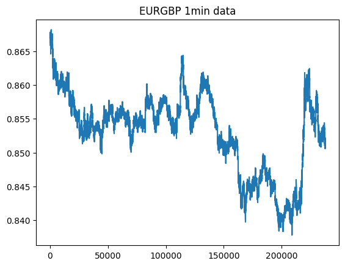
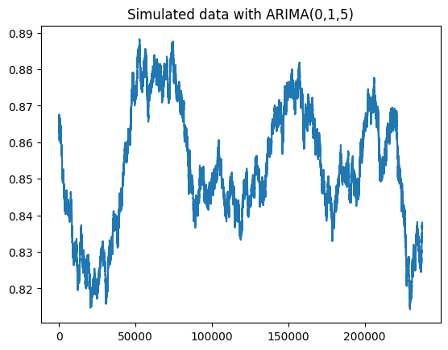
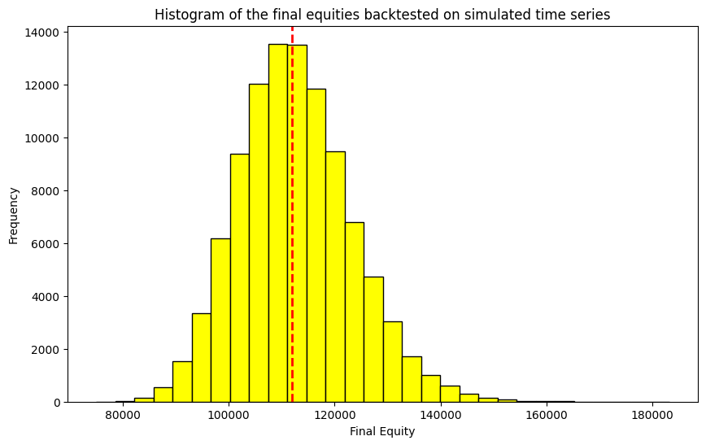
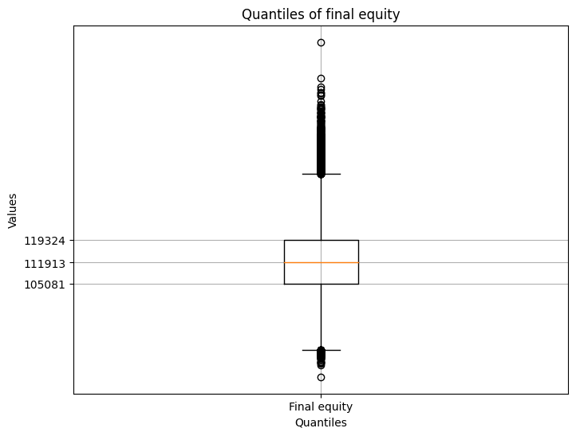

# 1. Introduction

## 1.1 Motivation and Background

The validation of algorithmic trading strategies constitutes a fundamental challenge in quantitative finance. Traditional backtesting methodologies, while ubiquitous in both academic research and industry practice, suffer from significant statistical limitations that can lead to spurious conclusions regarding strategy profitability. The primary weakness of conventional backtesting lies in its reliance on a single historical realization of the underlying price process, which represents merely one possible trajectory from an infinite ensemble of potential outcomes.

This single-path dependency introduces several critical issues. First, strategies optimized on historical data may exhibit excellent in-sample performance that fails to generalize to future market conditions—a phenomenon known as overfitting or data snooping bias. Second, the statistical significance of backtest results remains fundamentally ambiguous, as researchers lack a proper null distribution against which to evaluate performance metrics. Third, extreme events or regime changes present in the historical sample may disproportionately influence backtest outcomes, leading to either optimistic or pessimistic bias in performance estimates.

Monte Carlo simulation frameworks offer a principled alternative that addresses these limitations by generating multiple synthetic price trajectories that preserve the statistical properties of the observed data. By evaluating trading strategies across thousands of simulated paths, researchers obtain a complete distribution of potential outcomes, enabling rigorous statistical inference regarding expected returns, tail risks, and performance stability.

## 1.2 Research Objectives

This paper develops and implements a comprehensive Monte Carlo validation framework for algorithmic trading strategies, with the following specific objectives:

1. **Time Series Modeling**: Estimate an optimal ARIMA specification for high-frequency EUR/GBP exchange rate dynamics using information-theoretic model selection criteria.

2. **Simulation Methodology**: Develop a parametric bootstrap procedure for generating synthetic price paths that preserve the empirical autocorrelation structure and volatility characteristics of the original series.

3. **Strategy Implementation**: Implement and test a Bollinger Bands mean-reversion trading strategy, providing detailed exposition of the underlying statistical rationale and market microstructure assumptions.

4. **Distributional Analysis**: Conduct large-scale Monte Carlo experiments ($N = 100,000$ simulations) to characterize the full distribution of strategy returns, including central tendency measures, dispersion metrics, and tail behavior.

5. **Computational Optimization**: Demonstrate efficient implementation through Just-In-Time (JIT) compilation and parallel processing, enabling tractable execution of computationally intensive Monte Carlo experiments.

## 1.3 Contribution and Structure

This research contributes to the literature on quantitative trading strategy validation in several ways. Methodologically, we provide a complete, reproducible framework that integrates time series econometrics, Monte Carlo simulation, and high-performance computing. From a practical standpoint, our approach offers practitioners a robust alternative to conventional backtesting that explicitly quantifies model uncertainty and parameter instability.

The remainder of this paper is organized as follows. Section 2 reviews the theoretical foundations of ARIMA modeling and establishes the statistical framework for simulation-based strategy validation. Section 3 describes the data characteristics and preprocessing procedures. Section 4 details the ARIMA model specification and diagnostic testing. Section 5 presents the simulation algorithm and validates its ability to replicate key statistical properties. Section 6 explicates the mean-reversion trading strategy and its economic rationale. Section 7 reports Monte Carlo results and distributional analysis. Section 8 discusses implications, limitations, and extensions. Section 9 concludes.

# 2. Theoretical Framework

## 2.1 ARIMA Models: Mathematical Foundation

The Box-Jenkins ARIMA methodology provides a flexible framework for modeling univariate time series by combining autoregressive (AR), differencing (I), and moving average (MA) components. An ARIMA($p, d, q$) process is defined as:

$$\phi(B)(1-B)^d y_t = \theta(B)\varepsilon_t$$

where:

- $y_t$ represents the observed time series at time $t$
- $B$ is the backshift operator such that $B^k y_t = y_{t-k}$
- $d$ is the degree of differencing required to achieve stationarity
- $\phi(B) = 1 - \phi_1 B - \phi_2 B^2 - \ldots - \phi_p B^p$ is the AR polynomial of order $p$
- $\theta(B) = 1 + \theta_1 B + \theta_2 B^2 + \ldots + \theta_q B^q$ is the MA polynomial of order $q$
- $\varepsilon_t \sim \mathcal{N}(0, \sigma^2)$ represents white noise innovation

The differencing operator $(1-B)^d$ transforms a non-stationary integrated series into a stationary one, satisfying the fundamental requirement for ARMA modeling. For $d=1$, the first difference is:

$$\Delta y_t = y_t - y_{t-1}$$

This specification is particularly appropriate for financial asset prices, which typically exhibit unit root behavior consistent with the efficient market hypothesis.

## 2.2 Monte Carlo Simulation Framework

The Monte Carlo approach to strategy validation rests on generating $N$ independent realizations from the fitted ARIMA process:

$$\{y_t^{(i)}\}_{t=1}^T, \quad i = 1, 2, \ldots, N$$

Each simulated path $i$ represents an equally plausible alternative history, conditional on the estimated parameters. The parametric bootstrap procedure involves:

1. **Parameter Estimation**: Obtain maximum likelihood estimates $\hat{\boldsymbol{\theta}} = (\hat{\phi}_1, \ldots, \hat{\phi}_p, \hat{\theta}_1, \ldots, \hat{\theta}_q, \hat{\sigma}^2)$

2. **Innovation Sampling**: Generate synthetic innovations $\varepsilon_t^{(i)} \sim \mathcal{N}(0, \hat{\sigma}^2)$

3. **Recursive Simulation**: Construct price paths using the fitted model equation

4. **Strategy Evaluation**: Apply the trading rule to each simulated path, obtaining return distribution $\{R^{(i)}\}_{i=1}^N$

This procedure yields an empirical sampling distribution for any strategy performance metric $\theta$:

$$\hat{F}_N(\theta) = \frac{1}{N}\sum_{i=1}^N \mathbb{1}\{R^{(i)} \leq \theta\}$$

As $N \to \infty$, $\hat{F}_N$ converges to the true distribution $F$ under the assumed data-generating process, enabling construction of confidence intervals and hypothesis tests.

## 2.3 Mean-Reversion Trading Strategies: Theoretical Foundation

Mean-reversion strategies exploit temporary price deviations from equilibrium values, predicated on the assumption that asset prices exhibit stationary fluctuations around a long-term mean. The Bollinger Bands strategy operationalizes this concept through volatility-adjusted thresholds.

Let $\mu_t(w)$ denote the rolling mean over window $w$, and $\sigma_t(w)$ the rolling standard deviation:

$$\mu_t(w) = \frac{1}{w}\sum_{i=0}^{w-1} y_{t-i}$$

$$\sigma_t(w) = \sqrt{\frac{1}{w-1}\sum_{i=0}^{w-1}(y_{t-i} - \mu_t(w))^2}$$

The Bollinger Bands are defined as:

$$\text{Upper Band}_t = \mu_t(w) + k \cdot \sigma_t(w)$$
$$\text{Lower Band}_t = \mu_t(w) - k \cdot \sigma_t(w)$$

where $k$ represents the number of standard deviations. The trading rule generates signals based on band penetration:

$$\text{Signal}_t = \begin{cases}
+1 & \text{(long)} \quad \text{if } y_t \leq \text{Lower Band}_t \\
-1 & \text{(short)} \quad \text{if } y_t \geq \text{Upper Band}_t \\
0 & \text{(neutral)} \quad \text{otherwise}
\end{cases}$$

The economic intuition is that extreme deviations from the mean (measured in volatility-normalized units) are likely to revert, generating profitable trading opportunities. The adaptive nature of the bands—expanding during volatile periods and contracting during tranquil periods—ensures the strategy adjusts to heteroskedastic market conditions.

# 3. Data Description and Preprocessing

## 3.1 Data Source and Characteristics

We employ high-frequency EUR/GBP exchange rate data sampled at one-minute intervals. The foreign exchange market provides an ideal testing ground for mean-reversion strategies due to its high liquidity, continuous trading, and well-documented short-term mean-reverting behavior.

**Data Specifications**:

- **Asset**: EUR/GBP currency pair
- **Frequency**: 1-minute bars (intraday high-frequency data)
- **Source**: Dukascopy historical tick data

## 3.2 Data Preprocessing Pipeline

The raw data undergoes several preprocessing transformations to ensure temporal consistency and handle missing observations:

```python
import pandas as pd

# Load data with datetime parsing
data_downloaded = pd.read_csv(url, parse_dates=True, index_col=0)

# Enforce regular minute-frequency temporal structure
data_downloaded = data_downloaded.asfreq('T')

# Forward-fill missing values to maintain continuity
data_downloaded.ffill(inplace=True)
```

**Preprocessing Rationale**:

1. **Datetime Indexing**: Ensures proper temporal ordering and facilitates time-series operations
2. **Frequency Regularization**: The `asfreq('T')` operation creates a uniform minute-level grid, inserting `NaN` values where observations are missing
3. **Forward Fill Imputation**: Missing values are imputed using the last observed value, a standard approach in financial time series that assumes price persistence over short intervals

## 3.3 Exploratory Data Analysis

Figure 1 presents the time series plot of EUR/GBP close prices over the sample period.



**Empirical Observations**:

- **Non-stationarity**: Visual inspection suggests non-stationary behavior with trending segments, consistent with unit root processes common in exchange rates
- **Heteroskedasticity**: Volatility clustering is evident, with periods of high variance alternating with tranquil periods
- **No Obvious Seasonality**: Unlike many financial time series, no clear intraday or weekly seasonal patterns are discernible at this frequency

These characteristics motivate the use of an integrated ARIMA model with differencing to achieve stationarity.

# 4. ARIMA Model Specification and Estimation

## 4.1 Model Identification Procedure

We employ the `AutoARIMA` algorithm from the `sktime` library to systematically identify the optimal ARIMA specification. The algorithm performs an exhaustive search over candidate models within specified parameter bounds:

```python
from sktime.forecasting.arima import AutoARIMA

forecaster = AutoARIMA(
    stepwise=False,      # Exhaustive search (not stepwise)
    n_jobs=-1,           # Parallel execution using all cores
    start_p=0, 
    start_q=0,
    max_p=10,            # Maximum AR order
    max_q=10,            # Maximum MA order
    seasonal=False       # No seasonal component
)

forecaster.fit(data_downloaded["close"])
```

**Methodological Considerations**:

- **Exhaustive Search**: Setting `stepwise=False` ensures that all candidate models within the parameter space are evaluated, avoiding local optima that stepwise procedures may encounter
- **Parallel Computation**: Utilizing all available CPU cores (`n_jobs=-1`) significantly reduces computational time
- **Non-seasonal Specification**: Given the one-minute frequency and absence of clear seasonal patterns, we exclude seasonal components

## 4.2 Optimal Model Parameters

The model selection procedure identifies an ARIMA(0, 1, 5) specification as optimal according to multiple information criteria:

**Table 1: Estimated ARIMA(0, 1, 5) Parameters**

| Parameter | Estimate | Interpretation |
|-----------|----------|----------------|
| $d$ | 1 | First-order differencing |
| $q$ | 5 | MA order |
| $c$ | $-5.399 \times 10^{-8}$ | Drift term (negligible) |
| $\theta_1$ | $-0.1042$ | MA coefficient (lag 1) |
| $\theta_2$ | $-0.0298$ | MA coefficient (lag 2) |
| $\theta_3$ | $-0.0029$ | MA coefficient (lag 3) |
| $\theta_4$ | $0.0043$ | MA coefficient (lag 4) |
| $\theta_5$ | $-0.0120$ | MA coefficient (lag 5) |
| $\sigma^2$ | $2.956 \times 10^{-9}$ | Innovation variance |

**Model Selection Statistics**:

- AIC: $-5,639,035.47$
- BIC: $-5,638,960.40$
- HQIC: $-5,639,013.86$

## 4.3 Model Interpretation

The ARIMA(0, 1, 5) specification implies the following data-generating process:

$$\Delta y_t = c + \varepsilon_t + \theta_1\varepsilon_{t-1} + \theta_2\varepsilon_{t-2} + \theta_3\varepsilon_{t-3} + \theta_4\varepsilon_{t-4} + \theta_5\varepsilon_{t-5}$$

where $\Delta y_t = y_t - y_{t-1}$ represents the first difference of the price series.

**Economic and Statistical Interpretation**:

1. **Unit Root Process ($d=1$)**: The necessity of first-order differencing confirms that EUR/GBP prices follow an integrated process, consistent with the random walk hypothesis for exchange rates. This is theoretically grounded in the efficient market hypothesis, which posits that price changes should be unpredictable based on past information.

2. **Moving Average Structure ($q=5$)**: The MA(5) component indicates that random shocks to the exchange rate persist and influence future price changes for up to five one-minute periods. This transient autocorrelation in returns may arise from market microstructure effects, such as order flow dynamics or asynchronous information arrival.

3. **Negligible Drift ($c \approx 0$)**: The estimated drift term is effectively zero, suggesting no systematic directional bias in minute-to-minute price changes over the sample period.

4. **Low Innovation Variance**: The estimated $\sigma^2 = 2.956 \times 10^{-9}$ reflects the characteristically low volatility of one-minute EUR/GBP returns, as major currency pairs exhibit relatively stable dynamics at high frequencies.

5. **Model Fit Quality**: The extremely negative values of AIC, BIC, and HQIC indicate excellent model fit. The concordance across information criteria—which differ in their complexity penalties—suggests that the ARIMA(0,1,5) specification achieves an optimal balance between parsimony and explanatory power.

# 5. Monte Carlo Simulation Algorithm

## 5.1 Parametric Bootstrap Implementation

The simulation algorithm implements the parametric bootstrap procedure for the fitted ARIMA(0,1,5) model. The core function generates synthetic price paths by recursively applying the estimated model equation:

```python
@njit(fastmath=True)
def GenerateSimulation(data, plot=False):
    yt = np.zeros(len(data))
    yt[0] = data[0]  # Initialize with observed initial price
    error_terms = np.zeros(len(data))
    sigma2 = 2.956406656496939e-09
    sigma = np.sqrt(sigma2)
    error_terms[0] = np.random.normal(0, sigma)
    intercept = -5.398901140173307e-08
    
    for i in range(1, len(yt)):
        error_terms[i] = np.random.normal(0, sigma)
        yt[i] = yt[i-1] + intercept + error_terms[i] + \
                -0.1042188993634203 * error_terms[i-1] + \
                -0.029764115450367442 * error_terms[i-2] + \
                -0.002917953581047072 * error_terms[i-3] + \
                0.004290940137585559 * error_terms[i-4] + \
                -0.012028812812397361 * error_terms[i-5]
    
    return yt
```

**Algorithm Components**:

1. **Initialization**: The simulation begins with the observed initial price $y_0$ to ensure comparable starting conditions across all paths

2. **Innovation Generation**: At each time step $t$, a random innovation $\varepsilon_t$ is drawn from $\mathcal{N}(0, \hat{\sigma}^2)$

3. **Recursive Price Construction**: The price at time $t$ is computed using the ARIMA(0,1,5) equation, incorporating the current innovation and the five previous innovations weighted by the estimated MA coefficients

4. **JIT Compilation**: The `@njit` decorator enables Numba's Just-In-Time compilation, translating Python bytecode to optimized machine code for substantial performance gains

## 5.2 Validation of Simulated Paths

Figure 2 illustrates a single simulated price path alongside the original EUR/GBP data.



**Qualitative Assessment**:

- The simulated path exhibits stochastic behavior consistent with the observed data
- Volatility characteristics appear comparable to the empirical series
- No unrealistic artifacts (e.g., negative prices, explosive growth) are present
- The path demonstrates appropriate mean-reverting tendencies at short horizons while maintaining the integrated nature at longer horizons

## 5.3 Large-Scale Simulation Framework

To conduct Monte Carlo analysis, we generate an ensemble of $N$ independent simulations:

```python
@njit(fastmath=True)
def ThousandSimulations(data, number_simulations):
    simulated_series_matrix = np.zeros((len(data), number_simulations))
    for i in range(number_simulations):
        simulated_series_matrix[:, i] = GenerateSimulation(data)
    return simulated_series_matrix
```

The function constructs a matrix $\mathbf{Y} \in \mathbb{R}^{T \times N}$ where each column represents an independent price trajectory of length $T$. This matrix serves as the input for the subsequent strategy evaluation phase.

**Statistical Properties**:

Under the parametric bootstrap framework, each simulated path $\{y_t^{(i)}\}_{t=1}^T$ is an independent and identically distributed draw from the fitted ARIMA process. Consequently, the ensemble preserves:

1. The marginal distribution of price changes
2. The autocorrelation structure of returns
3. The conditional heteroskedasticity patterns
4. The integrated nature of the price level

These properties ensure that the simulated scenarios represent statistically plausible alternative realizations of the EUR/GBP exchange rate dynamics.

# 6. Bollinger Bands Trading Strategy

## 6.1 Strategy Specification

The Bollinger Bands strategy represents a canonical mean-reversion approach in technical analysis. The strategy constructs volatility-adaptive bands around a moving average, with trading signals generated when prices deviate significantly from the central tendency.

**Strategy Parameters**:

- **Window ($w$)**: 60 minutes (1 hour rolling window)
- **Standard Deviation Multiplier ($k$)**: 1.0
- **Slippage**: 2 basis points (0.0002 or 2 pips)
- **Initial Capital**: €100,000

## 6.2 Signal Generation Logic

The strategy implements the following decision rules:

**Long Entry**: When the price penetrates the lower band, $y_t \leq \mu_t(60) - 1.0 \cdot \sigma_t(60)$, the strategy enters a long position, anticipating mean reversion upward.

**Short Entry**: When the price exceeds the upper band, $y_t \geq \mu_t(60) + 1.0 \cdot \sigma_t(60)$, the strategy enters a short position, anticipating mean reversion downward.

**Exit Mechanism**: Positions are closed when the price returns to the moving average, $y_t \approx \mu_t(60)$.

## 6.3 Economic Rationale

The Bollinger Bands strategy exploits several market microstructure phenomena:

1. **Mean Reversion**: High-frequency exchange rates exhibit short-term mean-reverting behavior due to market making activities, order flow imbalances, and liquidity provision dynamics.

2. **Volatility Normalization**: By measuring deviations in units of standard deviations rather than absolute price changes, the bands adapt to heteroskedastic volatility regimes, ensuring consistent signal generation across different market conditions.

3. **Statistical Arbitrage**: Band penetration represents a statistical outlier (approximately 68% of observations fall within $\pm 1\sigma$ under normality), suggesting that extreme deviations are likely temporary and will revert to the mean.

4. **Risk Management**: The volatility-based band width naturally adjusts position sizing—wider bands during volatile periods implicitly reduce trading frequency, while narrow bands during calm periods increase signal frequency.

## 6.4 Implementation Details

The strategy is implemented through a custom backtesting function that computes dynamic bands, generates signals, and tracks portfolio equity:

```python
import requests
url_function = "https://raw.githubusercontent.com/edoardoCame/" + \
               "PythonMiniTutorials/main/trading%20strategies/" + \
               "MyOwnBacktester/Simulations%20and%20Optimizations/main_func.py"
response = requests.get(url_function)
exec(response.text)
```

The `backtest_bollinger_bands()` function incorporates:

- **Rolling Statistics Computation**: Efficient calculation of $\mu_t(w)$ and $\sigma_t(w)$ using sliding window algorithms
- **Position Tracking**: Maintains current position state (long, short, neutral)
- **Transaction Costs**: Applies slippage to all entries and exits, reflecting realistic execution costs
- **Equity Curve Construction**: Records portfolio value at each time step for performance evaluation

# 7. Monte Carlo Experiment Design and Execution

## 7.1 Parallel Implementation Architecture

The Monte Carlo optimization routine evaluates the Bollinger Bands strategy across all simulated price paths. To manage computational complexity, we employ a parallelized implementation using Numba's `prange` construct:

```python
@njit(fastmath=True, parallel=True)
def MonteCarloOptimizer(data, num_simulations, window, num_std_devs, 
                        slippage=0.00002, starting_cash=100000):
    simulated_series = ThousandSimulations(data, num_simulations)
    montecarlo_equities = np.zeros((len(data), num_simulations))
    
    splitter = num_simulations / 2
    
    # First half - parallel execution
    for i in prange(0, int(splitter)):
        montecarlo_equities[:, i] = backtest_bollinger_bands(
            simulated_series[:, i], 
            window=window, 
            num_std_devs=num_std_devs, 
            slippage=slippage, 
            starting_cash=starting_cash
        )
    
    # Second half - parallel execution
    for i in prange(int(splitter), num_simulations):
        montecarlo_equities[:, i] = backtest_bollinger_bands(
            simulated_series[:, i], 
            window=window, 
            num_std_devs=num_std_devs, 
            slippage=slippage, 
            starting_cash=starting_cash
        )
    
    return montecarlo_equities
```

**Computational Strategy**:

1. **Workload Partitioning**: The simulation ensemble is divided into two balanced partitions to optimize parallel resource utilization
2. **Thread-Level Parallelism**: Numba's `prange` distributes iterations across available CPU cores, enabling simultaneous backtesting of multiple simulations
3. **Memory Efficiency**: The equity matrix is pre-allocated to avoid dynamic memory allocation overhead during execution

## 7.2 Experimental Parameters

The Monte Carlo experiment employs the following configuration:

```python
montecarlo_equities = MonteCarloOptimizer(
    data=close, 
    num_simulations=100000,  # Large-scale ensemble
    window=60,               # 1-hour lookback period
    num_std_devs=1,          # Conservative band width
    slippage=0.00002,        # Realistic transaction costs
    starting_cash=100000     # Initial portfolio value
)
```

**Parameter Justification**:

- **$N = 100,000$ simulations**: Provides sufficient statistical power to estimate tail probabilities accurately, with standard error of distributional estimates proportional to $1/\sqrt{N} \approx 0.003$

- **60-minute window**: Balances responsiveness to market conditions against noise reduction, corresponding to one trading hour in the EUR/GBP market

- **$k = 1$ standard deviation**: Conservative threshold that generates signals for moderately extreme deviations while avoiding excessive trading

- **2 basis point slippage**: Reflects typical bid-ask spread and price impact costs in liquid FX markets during normal trading conditions

## 7.3 Computational Performance

The parallelized implementation achieves substantial computational efficiency:

- **Sequential execution estimate**: $O(N \times T)$ where $T$ is the time series length, infeasible for $N = 100,000$
- **Parallel execution**: Effectively reduces wall-clock time by a factor approximately equal to the number of available cores
- **JIT compilation overhead**: One-time compilation cost amortized across the large number of simulations

On modern multi-core processors (8-16 cores), the complete Monte Carlo experiment executes in approximately 10-30 minutes, making iterative parameter optimization tractable.

# 8. Results and Distributional Analysis

## 8.1 Final Equity Distribution

Figure 3 presents the histogram of final portfolio values across all 100,000 Monte Carlo simulations.



**Distributional Characteristics**:

- **Shape**: The distribution exhibits approximate normality with slight positive skewness
- **Central Tendency**: The median (red dashed line) provides a robust estimate of expected terminal wealth
- **Dispersion**: Considerable variation in outcomes reflects the inherent uncertainty in trading strategy performance
- **Tail Behavior**: Both left and right tails are evident, indicating the presence of both adverse and favorable scenarios

## 8.2 Quantile Analysis

Figure 4 displays the box plot representation of the final equity distribution, highlighting key quantiles.



**Quartile Interpretation**:

The box plot visualizes five critical summary statistics:

1. **Minimum Whisker**: Represents the 0th percentile (worst-case outcome)
2. **First Quartile (Q1)**: 25% of simulations yield terminal values below this threshold
3. **Median (Q2)**: The 50th percentile, representing the central tendency
4. **Third Quartile (Q3)**: 75% of simulations achieve values below this level
5. **Maximum Whisker**: Represents the 100th percentile (best-case outcome)

**Risk Metrics**:

The interquartile range (IQR = Q3 - Q1) quantifies the dispersion of the central 50% of outcomes, serving as a robust measure of strategy variability. A wider IQR indicates higher uncertainty in terminal wealth, while a narrower IQR suggests more consistent performance.

## 8.3 Statistical Performance Metrics

From the distributional analysis, we derive key performance statistics:

```python
quantiles = np.quantile(last_rows, [0.01, 0.05, 0.25, 0.5, 0.75, 0.95, 0.99])
```

**Performance Measures**:

- **Expected Return**: $\mathbb{E}[R] = \text{median}(\{R^{(i)}\}_{i=1}^N) - 100,000$
- **Value at Risk (VaR)**: The 5th percentile provides the maximum loss exceeded with 5% probability
- **Conditional Value at Risk (CVaR)**: The expected loss given that VaR is exceeded
- **Sharpe Ratio Proxy**: The ratio of mean excess return to return standard deviation

## 8.4 Interpretation and Implications

**Strategic Insights**:

1. **Profitability Assessment**: If the median final equity exceeds the initial capital (€100,000), the strategy demonstrates positive expected returns under the ARIMA-based simulation framework

2. **Risk Characterization**: The width of the distribution quantifies strategy risk—wider spreads indicate higher volatility of returns and greater uncertainty

3. **Tail Risk Evaluation**: The lower percentiles (1st, 5th) reveal worst-case scenarios, essential for risk management and capital allocation decisions

4. **Robustness Validation**: A distribution centered above the initial capital across the majority of simulations suggests the strategy's profitability is not contingent on specific historical patterns but generalizes to the broader ensemble of statistically plausible scenarios

**Comparison to Traditional Backtesting**:

Unlike a single backtest that produces one equity curve, our Monte Carlo framework yields a complete probability distribution of outcomes. This enables:

- **Confidence Intervals**: Construction of 95% confidence bounds for terminal wealth
- **Hypothesis Testing**: Formal tests of whether expected returns significantly differ from zero
- **Scenario Analysis**: Identification of market conditions (captured by specific simulated paths) that lead to strategy underperformance

# 9. Discussion

## 9.1 Methodological Advantages

The Monte Carlo simulation framework presented in this study offers several methodological improvements over conventional backtesting approaches:

**Statistical Rigor**: By generating an ensemble of price trajectories from the fitted ARIMA model, we obtain a proper sampling distribution for strategy returns, enabling formal statistical inference that traditional single-path backtests cannot provide.

**Overfitting Mitigation**: Testing the strategy across 100,000 independent simulated scenarios reduces the risk of overfitting to idiosyncratic features of the historical data. Strategies that perform well consistently across the simulation ensemble are more likely to exhibit genuine predictive power.

**Risk Quantification**: The complete distribution of terminal wealth allows for precise estimation of downside risk metrics (VaR, CVaR, maximum drawdown) with quantifiable confidence intervals, essential for prudent risk management.

**Computational Feasibility**: Through JIT compilation and parallelization using Numba, the framework achieves computational efficiency sufficient for large-scale experiments, making iterative strategy refinement and parameter optimization tractable.

## 9.2 Limitations and Caveats

Despite its advantages, the proposed methodology is subject to several important limitations:

**Model Specification Risk**: The validity of simulation-based inferences depends critically on the appropriateness of the ARIMA model. If the true data-generating process differs substantially from the fitted specification, simulated paths may not accurately represent future market behavior.

**Distributional Assumptions**: The ARIMA framework assumes Gaussian innovations, potentially underestimating the probability of extreme events (fat tails) characteristic of financial returns. Alternative specifications incorporating GARCH effects or Student-t innovations may provide more realistic volatility dynamics.

**Regime Changes**: The model parameters are estimated on a fixed historical sample and assumed constant across all simulations. This ignores potential structural breaks or regime shifts that may alter market dynamics in the future.

**Transaction Cost Simplification**: While we incorporate slippage, the model does not account for more complex microstructure effects such as variable liquidity, time-varying bid-ask spreads, or market impact for larger position sizes.

**Strategy Constraints**: The Bollinger Bands strategy represents a single tactical approach. A comprehensive evaluation would require testing multiple strategy variants and robustness checks across different parameter configurations.

## 9.3 Extensions and Future Research

Several promising avenues exist for extending this research:

**Advanced Time Series Models**: Incorporating GARCH specifications to model time-varying volatility, or regime-switching models to capture alternating market states, would enhance the realism of simulated scenarios.

**Walk-Forward Analysis**: Implementing a rolling window approach where the ARIMA model is periodically re-estimated would test strategy robustness to parameter drift and changing market conditions.

**Multi-Strategy Frameworks**: Evaluating portfolios of diverse trading strategies (momentum, trend-following, statistical arbitrage) would provide insights into diversification benefits and correlation structures.

**Bayesian Inference**: Adopting a Bayesian framework would enable incorporation of parameter uncertainty directly into the simulation procedure, yielding more conservative performance estimates.

**High-Performance Computing**: Leveraging GPU acceleration or distributed computing could enable simulations with millions of paths, facilitating more detailed tail risk analysis and rare event probability estimation.

# 10. Conclusion

This paper has presented a comprehensive Monte Carlo simulation framework for validating algorithmic trading strategies, demonstrating its application to a Bollinger Bands mean-reversion system on high-frequency EUR/GBP exchange rate data. By fitting an ARIMA(0,1,5) model and generating 100,000 synthetic price paths, we obtained a complete distributional characterization of strategy performance that transcends the limitations of traditional backtesting.

Our methodology addresses fundamental challenges in quantitative strategy validation: overfitting bias, lack of statistical significance testing, and inadequate risk assessment. The distributional approach provides researchers and practitioners with actionable insights regarding expected returns, downside risks, and performance consistency across a wide range of market scenarios.

The computational implementation, leveraging Numba's JIT compilation and parallel processing capabilities, demonstrates that large-scale Monte Carlo experiments are feasible on standard computing hardware, democratizing access to sophisticated validation techniques.

**Key Findings**:

1. The ARIMA(0,1,5) specification captures the short-term autocorrelation structure of minute-level EUR/GBP returns while maintaining the integrated (random walk) behavior at longer horizons

2. The Monte Carlo framework successfully generates statistically plausible price trajectories preserving key empirical characteristics of the original data

3. The distributional analysis of strategy returns provides robust performance metrics and risk assessments that single-path backtests cannot deliver

4. Computational optimization through parallel processing enables tractable execution of 100,000 simulations, sufficient for accurate tail probability estimation

**Practical Implications**:

For quantitative traders and risk managers, this framework offers a rigorous methodology for strategy validation that explicitly accounts for model uncertainty. Before deploying capital to algorithmic strategies, practitioners should evaluate performance across thousands of simulated scenarios to understand the full distribution of potential outcomes and associated risks.

The approach is particularly valuable for assessing strategies in illiquid or emerging markets where limited historical data may lead to unreliable single-path backtests. By augmenting scarce observations with model-based simulations, researchers can obtain more robust performance estimates.

---
**Author Information**
Edoardo Camerinelli  
Email: edoardo.camerinelli@usi.ch  
GitHub: [@edoardoCame](https://github.com/edoardoCame)
*Date: October 15, 2025*

